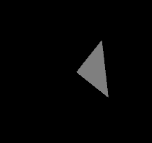
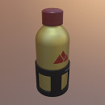
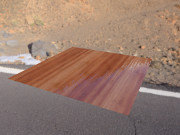
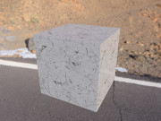
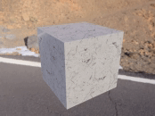
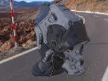

# glTF 2.0 Sample Models

**Note:** These models are not yet updated to glTF 2.0!

## Simple models for testing individual features

| Model                                                  | Screenshot                                                      | Description|
|--------------------------------------------------------|-----------------------------------------------------------------|------------|
| [Triangle Without Indices](TriangleWithoutIndices)     |            | The simplest possible glTF asset: A single `scene` with a single `node` and a single `mesh` with a single `mesh.primitive` with a single triangle with a single attribute, without indices and without a `material` |
| [Triangle](Triangle)                                   |                          | A very simple glTF asset: The basic structure is the same as in [Triangle Without Indices](TriangleWithoutIndices), but here, the `mesh.primitive` describes an *indexed* geometry
| [Animated Triangle](AnimatedTriangle)                  |                  | This sample is similar to the [Triangle](Triangle), but the `node` has a `rotation` property that is modified with a simple `animation` |
| [Simple Material](SimpleMaterial)                      |                    | This sample is similar to the [Triangle](Triangle), but additonally defines a `material` that consists of an emissive color |
| [Simple Meshes](SimpleMeshes)                          |                      | A simple `scene` with two `nodes`, both containing the same `mesh`, namely a `mesh` with a single `mesh.primitive` with a single indexed triangle with *multiple* attributes (positions, normals and texture coordinates), but without a `material` |
| [Advanced Material](AdvancedMaterial)                  |                  | This sample is similar to the [Simple Meshes](SimpleMeshes), but defines a `material` that includes a light, and thus shows the effect of the normals attribute |
| [Simple Opacity](SimpleOpacity)                        |                     | A simple `scene` with multiple `nodes`, `meshes` and `materials`, where each `material` has different opacity values, ranging from fully transparent to fully opaque |
| [Simple Texture](SimpleTexture)                        |                     | A sample with a `material` that uses a single `texture` |
| [Cameras](Cameras)                                     |                           | A sample with two different `camera` objects |
| [Simple Skin](SimpleSkin)                              |                        | A sample with a `skin`, showing very basic vertex skinning. **Note: Parts of the skinning definitions still have to be finalized for glTF 1.1!** |

## Models for testing materials

| Model                 | Screenshot                                | Description |
|-----------------------|:-----------------------------------------:|-----------|
| [Boom Box](BoomBox)   |     | <ul><li>PBR material textures (no factors)</li><li>Additional maps used: normal map, occlusion map, emissive map</li></ul>|
| [Water Bottle](WaterBottle)   |     | <ul><li>PBR material textures (no factors)</li><li>Additional maps used: normal map, occlusion map, emissive map</li></ul>|
| [Corset](Corset)      |      | <ul><li>PBR material textures (no factors)</li><li>Additional maps used: normal map, occlusion map</li></ul>|
| [Lantern](Lantern)    |     | <ul><li>PBR material textures and factors</li><li>Additional maps used: normal map, occlusion map, emissive map</li></ul>|
| [Two Sided Plane](TwoSidedPlane)                       |                     | <ul><li>A plane having the two sided material parameter enabled.</li></ul>  |
| [Apple Tree](AppleTree)|                     | <ul><li>Double sided materials with alphaMode `MASK`</li></ul>  |
| [Farmland diorama](FarmlandDiorama)                       | | <ul><li>Double sided materials with alphaMode `MASK`</li></ul>  |
| [Smiling face with vertex colors](SmilingFaceVertexColors)|                     | <ul><li>Vertex colors used along with materials for lighting calculations.</li></ul>  |
| [Telephone](Telephone)|                     | <ul><li>All textures stored as JPEG except for specularGlossiness texture.</li></ul>  |
| [Todo](Todo)|                     | <ul><li>Material with alphaCutoff</li></ul>  |
| [Todo](Todo)|                     | <ul><li>Material with alphaMode `BLEND`</li></ul>  |
| [Todo](Todo)|                     | <ul><li>Material texture with alpha channel but no alphaMode set in JSON (alpha channel must be ignored).</li></ul>  |
| [Todo](Todo)|                     | <ul><li>Multi-UV textures</li></ul>  |
| [Todo](Todo)|                     | <ul><li>Normal scale</li></ul>  |
| [Todo](Todo)|                     | <ul><li>Occlusion strength</li></ul>  |

### Standard environments for testing material
Todo: These environments were used to generate screenshots 
- Simple Light: type of light and position
- Cubemap
- HDR cubemap

## Further PBR models

| Model                                                  | Screenshot                                                      | Description|
|--------------------------------------------------------|-----------------------------------------------------------------|------------|
| [Cube](Cube)                                           |                              | A cube with non-smoothed faces.                                |
| [Animated Cube](AnimatedCube)                          |                      | Same as previous cube having a linear rotation animation.      |
| [Suzanne](Suzanne)                                     |                           | Suzanne from Blender with smoothed faces.                      |
| [Sci Fi Helmet](SciFiHelmet)                           |                       | Sci Fi Helmet having unsigned integer indices.                 |
